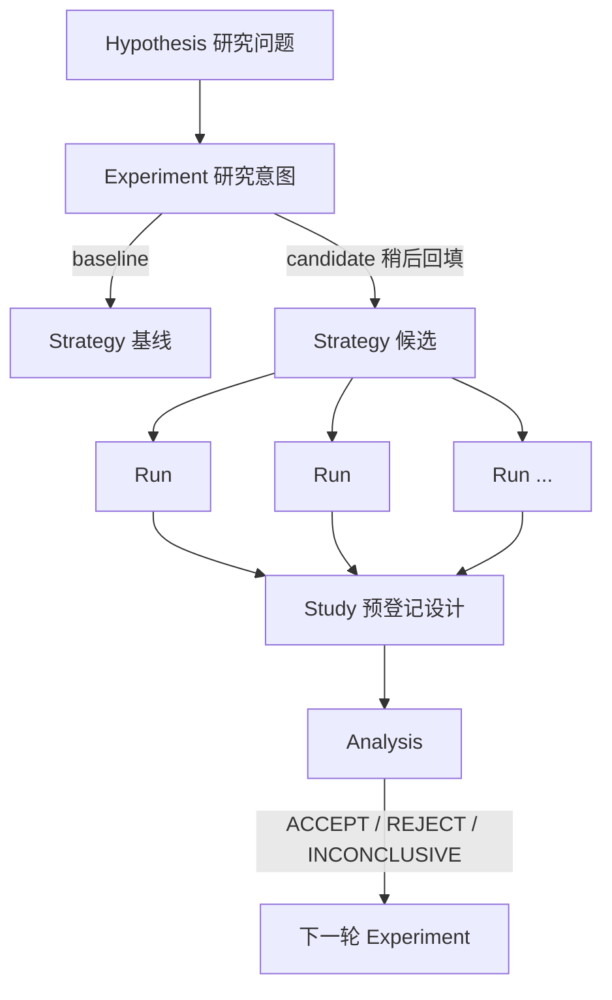

# 小市值策略 Research Registry — 落地实现设计

> 本文档是 `docs/研究登记系统v1定稿.md` 的落地实现规格。定稿为设计基准，本文档记录 2026-08-20 经用户确认的三项决策，并给出完整可实施的 schema、CLI、模板与验收标准。实现以本文档为准，定稿仅在本文档未覆盖处作补充参考。

## 0. 决策记录（用户确认，2026-08-20）

| # | 决策 | 内容 |
|---|---|---|
| D1 | 6 个查漏字段**全部纳入 v1** | n_trades / benchmark / benchmark_return / regime / n_trials / study_runs.partition；drawdown_recovery 作为约定指标名（metrics 表键值对天然支持，无需改 schema） |
| D2 | **不迁移历史数据** | 2021 日志回测、2024/2026 转述回测均不建 Run；从当前代码状态开始登记，历史脉络由 git 历史承担 |
| D3 | **全部实现 7 个 Phase** | 一次交付完整 v1，含 Markdown 生成与 AGENTS.md 联动 |

### 新增字段用途（Librarian 业界实践调研依据）

- `runs.n_trades`：调仓次数。判断回测结果统计可信度（业界标准：调仓/交易 ≥50 次才有统计意义）；支撑换手率分析；可发现"设置 5 天调仓实际只调 3 次"的代码 bug
- `runs.benchmark` + `runs.benchmark_return`：基准指数与基准收益（聚宽报告自带）。记录后才能计算超额收益（策略收益 − 基准收益），区分策略 alpha 与市场 beta
- `experiments.n_trials`：试验次数（默认 1）。DSR（Deflated Sharpe）、PBO（Probability of Backtest Overfitting）等过拟合统计检验的输入；定稿诊断项 "Best-vs-Median Gap" 也隐含依赖它
- `study_runs.partition`：is/oos 区间角色。定稿过拟合诊断 "IS-OOS Gap"（样本内 vs 样本外表现差距）自动化计算的前提；v1 的 ROLLING 滚动窗口天然分 IS 段与 OOS 段
- `drawdown_recovery`（约定指标名）：回撤恢复天数。判断回撤性质（20 天恢复 vs 200 天恢复风险完全不同），业界回测阅读顺序排第 2 位
- `runs.regime`：市场状态 bull/bear/sideways/unknown。跨时期对比前提——2021 熊市与 2024 牛市结果无直接可比性；按状态分组分析策略的牛熊表现

## 1. 目标与非目标

### v1 解决 6 件事

1. 现在这份代码是谁（版本 identity）
2. 它从哪个版本派生而来（lineage）
3. 这次改了什么、为什么改（change + rationale）
4. 这份代码跑过哪些聚宽回测（strategy → run 追溯）
5. 一个研究问题涉及哪些回测（run → study 组织）
6. 目前认为这个改动有效 / 无效 / 证据不足（study → analysis 结论）

### 暂不做

自动提交聚宽、自动拉取聚宽结果、实时交易、在线 Server、Web 前端、自动解析聚宽截图、自动生成 QuantStats 报告、历史数据迁移（决策 D2）、WALK_FORWARD/OOS 研究类型、Schema 迁移机制、多策略 project/strategy_family 维度、Run 数据 merge 机制（后四项为定稿 §14 明确留给 v2）。

## 2. 目录结构

```
小市值/
├── 小市值策略代码.md          # 唯一工作源码，不变
├── 聚宽回测结果及运行日志.md   # 唯一的原始聚宽粘贴内容入口，不变
├── 优化方向.md                # 不变
└── research/
    ├── registry.db             # 结构化数据源头，纳入 git 提交
    ├── README.md               # 十条宪法
    ├── schema.sql
    ├── __init__.py / __main__.py / cli.py / db.py / ids.py
    ├── git_meta.py             # 封装 git 调用（替代原方案 hashing.py）
    ├── strategy.py / hypothesis.py / experiment.py / run.py / study.py / analysis.py
    ├── templates.py / reports.py
    ├── tests/                  # pytest 惯例（参照 joinquant-docs/tools/test_export.py）
    │   ├── test_db.py / test_ids.py / test_git_meta.py
    │   ├── test_strategy.py / test_experiment.py
    │   └── test_run.py / test_study.py / test_analysis.py
    ├── strategies/Sxxxx.md
    ├── experiments/Exxxxx.md
    ├── runs/Rxxxx.md
    ├── studies/STxxxx.md
    └── analyses/Axxxx.md
```

## 3. 核心对象与关系

```text
Strategy   = 代码状态（git commit hash + file blob hash 标识）
Hypothesis = 最初想验证什么
Experiment = 为什么改（一个研究假设 + 一批共同服务于它的代码修改）
Run        = 一次真实聚宽回测
Study      = 为回答一个问题组织的一组 Run（预先登记设计，防止事后凑数据）
Analysis   = 这些 Run 说明什么（结论 + 证据强度）
```



Strategy 之间"谁是谁的父版本"直接用 git commit 历史回答，不单独维护 diff 机制。

## 4. Schema（SQLite，完整实现版）

```sql
-- ============================================================
-- schema.sql — Research Registry v1（落地实现版）
-- Python 3.12 + SQLite 标准库
-- db.py 每次建立连接后必须执行 PRAGMA foreign_keys = ON;
-- 原因：ID 是人工可读字符串（S0024 这类）不是自增整数，打错一位数字
-- 在未开约束时会静默产生指向错误策略的记录，开了约束至少 insert 时报错拦截
-- ============================================================

CREATE TABLE strategies (
    strategy_id         TEXT PRIMARY KEY,   -- S0001, S0002, ...
    parent_strategy_id  TEXT,               -- NULL 表示根版本

    name                TEXT NOT NULL,
    source_path         TEXT NOT NULL,      -- 固定为 "小市值/小市值策略代码.md"

    git_commit_hash     TEXT NOT NULL,      -- `git rev-parse HEAD`
    file_blob_hash      TEXT NOT NULL,      -- `git hash-object <file>`，内容指纹，
                                            -- 与 commit 解耦，识别"内容未变但重复登记"

    change_summary      TEXT,               -- 默认取 git commit message，CLI 可覆盖

    created_at          TEXT NOT NULL,

    FOREIGN KEY (parent_strategy_id) REFERENCES strategies(strategy_id)
);

CREATE TABLE hypotheses (
    hypothesis_id   TEXT PRIMARY KEY,       -- H0001, ...
    title           TEXT NOT NULL,
    description     TEXT NOT NULL,
    expected_effect TEXT,
    created_at      TEXT NOT NULL
);

CREATE TABLE experiments (
    experiment_id        TEXT PRIMARY KEY,  -- E0001, ...

    hypothesis_id        TEXT,
    baseline_strategy_id TEXT NOT NULL,     -- 每个实验必须有基线锚点
    candidate_strategy_id TEXT,             -- 允许为空：先建 Experiment 后回填

    title                TEXT NOT NULL,
    description          TEXT,

    change_scope         TEXT NOT NULL,     -- MICRO / SMALL / MEDIUM / LARGE / ARCHITECTURAL
    validation_tier      TEXT NOT NULL,     -- V1 / V2 / V3 / V4 / V5

    n_trials             INTEGER NOT NULL DEFAULT 1,  -- 试验次数（DSR/PBO 输入，决策 D1）

    status               TEXT NOT NULL DEFAULT 'PLANNED',  -- PLANNED / RUNNING / COMPLETED / ABANDONED

    created_at           TEXT NOT NULL,

    FOREIGN KEY (hypothesis_id) REFERENCES hypotheses(hypothesis_id),
    FOREIGN KEY (baseline_strategy_id) REFERENCES strategies(strategy_id),
    FOREIGN KEY (candidate_strategy_id) REFERENCES strategies(strategy_id)
);

CREATE TABLE runs (
    run_id          TEXT PRIMARY KEY,       -- R0001, ...

    strategy_id     TEXT NOT NULL,
    experiment_id   TEXT,                   -- 允许为空：快速检查点无正式 Experiment

    start_date      TEXT NOT NULL,
    end_date        TEXT NOT NULL,
    initial_capital REAL,
    frequency       TEXT,

    parameters_json TEXT,

    status          TEXT NOT NULL,          -- SUCCESS / FAILED / PARTIAL / INCOMPLETE
                                            -- INCOMPLETE：已知发生过但原始数据未完整留存

    error_type      TEXT,                   -- 仅 status=FAILED 时填，如 SecurityNotExist / TimeoutError
    error_message   TEXT,

    n_trades        INTEGER,                -- 调仓次数（决策 D1）
    benchmark       TEXT,                   -- 基准指数代码，如 000905.XSHG（决策 D1）
    benchmark_return REAL,                  -- 基准收益（决策 D1）
    regime          TEXT,                   -- bull / bear / sideways / unknown（决策 D1）

    source_log_path TEXT,                   -- 指向聚宽回测结果及运行日志.md 具体位置/锚点
    notes           TEXT,

    created_at      TEXT NOT NULL,

    FOREIGN KEY (strategy_id) REFERENCES strategies(strategy_id),
    FOREIGN KEY (experiment_id) REFERENCES experiments(experiment_id)
);

CREATE TABLE metrics (
    run_id       TEXT NOT NULL,
    metric_name  TEXT NOT NULL,
    metric_value REAL,
    metric_source TEXT NOT NULL,  -- joinquant_pasted / derived_local / manual_estimate / secondhand_mention
                                  -- secondhand_mention：数值来自优化方向.md 等二手转述，不可作为 Analysis 证据引用

    PRIMARY KEY (run_id, metric_name),
    FOREIGN KEY (run_id) REFERENCES runs(run_id)
);

-- 约定指标名（写入 metric_name，无 schema 变更）：
-- annual_return / max_drawdown / sharpe / volatility / win_rate / profit_loss_ratio /
-- calmar / sortino / drawdown_recovery / turnover_ratio / benchmark_excess_return

CREATE TABLE studies (
    study_id     TEXT PRIMARY KEY,  -- ST0001, ...
    experiment_id TEXT NOT NULL,

    study_type   TEXT NOT NULL,     -- SINGLE / ROLLING / FACTOR_LAYER / PARAMETER_SWEEP / ABLATION

    name         TEXT NOT NULL,
    description  TEXT,

    design_json  TEXT NOT NULL,     -- 必须在看到 Run 结果前登记，v1 强制 NOT NULL（防过拟合核心）

    created_at   TEXT NOT NULL,

    FOREIGN KEY (experiment_id) REFERENCES experiments(experiment_id)
);

CREATE TABLE study_runs (
    study_id    TEXT NOT NULL,
    run_id      TEXT NOT NULL,

    group_name  TEXT,               -- 分层/窗口分组名，如 "2020-2021"、"1-15"、"16-30"
    role        TEXT,               -- baseline / candidate
    partition   TEXT,               -- is / oos / NULL（决策 D1；SINGLE/参数扫描无 IS-OOS 概念时留空）

    PRIMARY KEY (study_id, run_id),
    FOREIGN KEY (study_id) REFERENCES studies(study_id),
    FOREIGN KEY (run_id) REFERENCES runs(run_id)
);

CREATE TABLE analyses (
    analysis_id   TEXT PRIMARY KEY,  -- A0001, ...
    study_id      TEXT NOT NULL,

    conclusion    TEXT,
    decision      TEXT,   -- ACCEPT / REJECT / INCONCLUSIVE / DEFER
    evidence_level TEXT,  -- E0 ~ E6
    confidence    REAL,

    report_path   TEXT,
    created_at    TEXT NOT NULL,

    FOREIGN KEY (study_id) REFERENCES studies(study_id)
);
```

**validation_tier 定义**：

- `V1`：单次回测即可判断方向，允许快速试错
- `V2`：至少一次 Rolling 多窗口验证
- `V3`：Rolling + 参数扰动（PARAMETER_SWEEP）
- `V4`：因子分层或消融（FACTOR_LAYER / ABLATION）之一
- `V5`：Rolling + Ablation + 参数稳定性组合；`change_scope = ARCHITECTURAL` 的改动默认起步要求 V4

**关键实现要点**：

- **运行目录约定**：所有命令从仓库根（`D:\量化\聚宽`）执行。`research` 包位于 `小市值/research/`，代码内部需自行定位仓库根（向上遍历查找 `.git` 目录），所有 git 子进程调用、`source_path`（`小市值/小市值策略代码.md`）、日志文件路径均以仓库根为基准。`__main__.py` 需把 `小市值` 目录加入 `sys.path` 或安装为本地包，确保 `python -m research` 从仓库根可执行。
- `strategy create` 执行前必须确认 `git status` 对 `小市值/小市值策略代码.md` 干净（无未提交改动），否则报错要求先 commit——`git_commit_hash` 必须对应硬盘上实际内容。**检查用 `git diff --quiet HEAD -- <file>`（或 `git -c core.quotepath=false status --porcelain` 解析），避免 Windows 下中文文件名被 git 默认转义（core.quotepath）导致误判**
- `git_commit_hash` 用 `git rev-parse HEAD`，`file_blob_hash` 用 `git hash-object 小市值/小市值策略代码.md`，均走 subprocess 调用标准 git 命令
- 版本间 diff 用 `git diff <hash1> <hash2> -- 小市值/小市值策略代码.md`，比手填 changed_modules 列表可靠
- `file_blob_hash` 相同时（内容未变又跑了一次 `strategy create`），CLI 给警告而非静默通过或强制拒绝——留给用户判断是否是有意回退重登记
- **根版本引导**：`strategy create` 不传 `--parent` 即创建根版本（`parent_strategy_id = NULL`），这是系统第一个 Strategy 的创建方式，也是任何 Experiment 创建前的先决条件
- **`strategies.name` 取值规则**：CLI 提供可选 `--name`；不传时默认取 `change_summary`（或 commit message）前 40 个字符截断
- **`strategy create --experiment E0008` 回填行为**：创建 Strategy 后必须校验 `E0008` 存在（`experiments` 表），并把其 `candidate_strategy_id` 更新为新 Strategy 的 ID；若该 Experiment 已有 candidate 则报错（一个 Experiment 只允许一个 candidate，走 promote 流程替换时先显式清空）

## 5. 归档 Markdown 模板

### `strategies/S0024.md`

```markdown
# S0024

## 基本信息
- Parent: S0023
- Git Commit: <hash>
- File Blob Hash: <hash>
- Created: 2026-08-18

## 变化
增加指数趋势风控。

## 关联实验
- E0008（若为快速检查点，此项留空）

## 关联回测
- R0152
- R0153
```

### `experiments/E0008.md`

```markdown
# E0008

## 核心假设
加入指数趋势风控可以降低系统性回撤。

## Baseline / Candidate
- Baseline: S0023
- Candidate: S0024

## Change Scope / Validation Tier
- Change Scope: LARGE
- Validation Tier: V4
- 试验次数: 3

## 预期
- Max Drawdown ↓
- Sharpe 不显著下降

## 验证计划
1. Rolling
2. Ablation
3. 参数稳定性

## 当前状态
RUNNING
```

### `runs/R0152.md`

```markdown
# R0152

## Strategy / Experiment
- Strategy: S0024
- Experiment: E0008

## Backtest 设置
- Start: 2020-01-01
- End: 2021-01-01
- Initial Capital: 1,000,000
- Frequency: daily
- 调仓次数: 12
- 基准: 000905.XSHG（基准收益 0.102）
- 市场状态: sideways

## Parameters
```yaml
rebalance_days: 5
```

## Status
SUCCESS

## Metrics

| 指标 | 数值 | 来源 |
|---|---|---|
| annual_return | 0.213 | joinquant_pasted |
| max_drawdown | 0.174 | joinquant_pasted |
| sharpe | 1.52 | joinquant_pasted |
| drawdown_recovery | 45 | joinquant_pasted |

## 原始数据位置
见 `聚宽回测结果及运行日志.md` 对应条目（按日期或锚点定位，不在此重复粘贴，避免两处数据不同步）

## Notes
...
```

### `studies/ST0012.md`

```markdown
# ST0012

## Experiment / 类型
- Experiment: E0008
- 类型: ROLLING

## 设计（预登记，禁止事后修改）
```yaml
type: ROLLING
windows:
  - {start: "2020-01-01", end: "2021-01-01", partition: is}
  - {start: "2021-01-01", end: "2022-01-01", partition: oos}
```

## Runs
| Run | 分组 | 角色 | 分区 | 收益 | 最大回撤 | Sharpe |
|---|---|---|---|---|---|---|
| R0152 | 2020-2021 | candidate | is | 0.213 | 0.174 | 1.52 |
| R0153 | 2020-2021 | baseline | is | 0.140 | 0.190 | 1.10 |

## 结论
（留空，由 Analysis 填写）
```

### `analyses/A0001.md`

```markdown
# A0001

## Study
ST0012

## 结论
候选策略在滚动窗口中方向一致，IS-OOS 差距在可接受范围。

## 决策
- Decision: ACCEPT
- Evidence Level: E2
- Confidence: 0.8

## 过拟合诊断
Overfitting Signals:
[WARN] 最优参数显著优于中位数
[OK] 多窗口方向一致
```

## 6. Study 类型与 v1 范围

v1 实现 5 种：

- `SINGLE` — 单次回测
- `ROLLING` — 滚动时间窗口（窗口定义写入 design_json，含 is/oos 分区）
- `FACTOR_LAYER` — 因子分层
- `PARAMETER_SWEEP` — 参数扫描（参数网格定义写入 design_json）
- `ABLATION` — 消融实验（逐一开关某个组件）

`WALK_FORWARD`、`OOS` 留 v2——需要专门实现滚动切分训练/验证窗口逻辑，工作量明显大于其余五种；Ablation 与 PARAMETER_SWEEP/FACTOR_LAYER 同为"沿一个维度分组、跑多个 Run"的机制，复用 `study_runs` 分组能力即可。

## 7. 两级工作流

- **快速检查点**（探索期，摩擦≈commit message）：

  ```powershell
  python -m research strategy create --quick --parent S0023 --summary "试一下调仓改10天，先看看方向对不对"
  ```

  只需 parent + 一句话摘要，git 哈希自动带上，不要求挂 Hypothesis/Experiment/scope/tier。

- **正式实验**：完整 Hypothesis → Experiment → Study → Analysis 链条。

- **升级路径**（promote）：快速检查点方向有戏时，用已有 Strategy 回填一个 Experiment：

  ```powershell
  python -m research promote `
    --strategy S0024 `
    --hypothesis H0012 --baseline S0023 `
    --title "调仓周期延长" --scope MICRO --tier V2
  ```

  `promote` 的内部行为：校验 `S0024` 存在且当前无关联 Experiment → 创建一条新的 `experiments` 记录（`candidate_strategy_id = S0024`，status 默认 PLANNED）→ 输出新 Experiment ID。即 promote 是"由快速检查点 Strategy 出发创建 Experiment"的唯一机制；不提供 `promote --experiment` 形式（Experiment 不存在，无法先引用它）。`experiment create` 用于先建 Experiment 后补 candidate 的场景（candidate 留空稍后回填），promote 用于先有 Strategy 后补 Experiment 的场景，二者并存但职责分明。

## 8. CLI 设计（全部非交互）

主要操作者是 AI 助手，一等接口必须是非交互式（flag 或一次性 JSON payload）。

```powershell
# 初始化
python -m research init

# 创建策略版本（非交互；执行前校验工作区无未提交改动）
python -m research strategy create `
  --parent S0023 --experiment E0008 `
  --summary "增加指数趋势风控，风险状态下降低目标仓位"

# 快速检查点
python -m research strategy create --quick --parent S0023 --summary "..."

# 查看
python -m research strategy show S0024
python -m research strategy tree S0001

# 假设与实验
python -m research hypothesis create --title "..." --description "..." --expected "Max Drawdown 下降"
python -m research experiment create `
  --hypothesis H0010 --baseline S0020 `
  --title "指数趋势风控" --scope ARCHITECTURAL --tier V5

# 登记一次聚宽回测：flag 形式
python -m research run create `
  --strategy S0024 --experiment E0008 `
  --start 2020-01-01 --end 2021-01-01 --capital 1000000 --status SUCCESS `
  --n-trades 12 --benchmark 000905.XSHG --benchmark-return 0.102 --regime sideways `
  --metric annual_return=0.213 --metric sharpe=1.52 --metric max_drawdown=0.174

# 失败回测同样要登记，不得删除
python -m research run create `
  --strategy S0024 --start 2020-01-01 --end 2021-01-01 `
  --status FAILED --error-type SecurityNotExist --error-message "..."

# JSON payload 形式（复杂/批量场景优先）
python -m research run create --from-json run_R0152.json

# Study：批量创建 Rolling 窗口 Run 并加入，避免逐条调用
python -m research study create --experiment E0008 --type ROLLING --name "5窗口滚动验证" --design rolling_design.json
python -m research study batch-add-runs ST0012 --from-json rolling_runs.json
python -m research study show ST0012

# 分析
python -m research analyze ST0012    # 输出统计 + 5 项过拟合诊断 WARNING
python -m research analysis create --study ST0012 --decision ACCEPT --evidence E2 --conclusion "..."

# 升级（快速检查点 → 正式实验，见 §7）
python -m research promote `
  --strategy S0024 --hypothesis H0012 --baseline S0023 `
  --title "调仓周期延长" --scope MICRO --tier V2
```

**命令执行前置约定**：全部命令从仓库根 `D:\量化\聚宽` 执行（见 §4 运行目录约定）。所有命令若依赖尚未存在的对象（如 experiment 引用不存在的 strategy），报错并给出提示，不做隐式创建（promote 是唯一例外：它显式创建 Experiment）。

`rolling_runs.json` 示例（`study batch-add-runs` 输入，一次创建 N 个 Run + metrics + 加入 Study）：

```json
[
  {
    "strategy": "S0024", "start": "2020-01-01", "end": "2021-01-01",
    "capital": 1000000, "status": "SUCCESS",
    "group": "2020-2021", "role": "candidate", "partition": "is",
    "n_trades": 12, "benchmark": "000905.XSHG", "benchmark_return": 0.102, "regime": "sideways",
    "metrics": {"annual_return": 0.18, "sharpe": 1.3, "max_drawdown": 0.15}
  },
  {
    "strategy": "S0010", "start": "2020-01-01", "end": "2021-01-01",
    "capital": 1000000, "status": "SUCCESS",
    "group": "2020-2021", "role": "baseline", "partition": "is",
    "metrics": {"annual_return": 0.14, "sharpe": 1.1, "max_drawdown": 0.19}
  }
]
```

## 9. 过拟合防护机制

- **Evidence Level**（E0-E6）：从"尚未验证"到"跨多个市场环境验证"。不是策略等级，是结论目前有多少证据支持。
- **5 个过拟合诊断指标**：Window Stability / Parameter Stability / Factor Monotonicity / IS-OOS Gap / Best-vs-Median Gap。
- v1 只输出 WARNING，不自动下"过拟合"结论，最终判断留给 Analysis 记录的人工/AI 决策：

  ```text
  Overfitting Signals:
  [WARN] 最优参数显著优于中位数
  [WARN] OOS Sharpe 明显低于 IS
  [OK]   多窗口方向一致
  [OK]   因子层级近似单调
  ```

- `baseline_strategy_id` 强制存在（schema NOT NULL），任何比较都有锚点。
- IS-OOS Gap 依赖 `study_runs.partition` 字段（决策 D1），未标注 partition 的 run 不参与该诊断。
- 数据纪律：`metrics.metric_source` 枚举强制——只有 `joinquant_pasted` 可作为 Analysis 证据引用，`secondhand_mention` 明确标注不可用于 Analysis 结论。
- **`regime` 判定约定**：由登记时的 AI 助手结合回测区间对应的指数走势（如中证 1000 该区间涨跌幅与波动）判断填写（bull/bear/sideways），拿不准填 `unknown`；该字段是辅助分析维度，不参与任何自动诊断。

## 10. 实施阶段（7 Phase）

### Phase 1：Registry 基础设施
- `schema.sql`（含全部 8 表，含决策 D1 新增列）
- `db.py`：连接管理、PRAGMA foreign_keys=ON、`exec` 执行 schema、查询辅助
- `ids.py`：按前缀查 MAX+1 生成下一个 ID（S/E/H/R/ST/A），单进程本地场景无需并发处理
- `git_meta.py`：封装 `git rev-parse` / `git hash-object` / `git log` / `git diff` / `git status --porcelain`，全部 subprocess
- 测试：`test_db.py` / `test_ids.py` / `test_git_meta.py`

### Phase 2：Strategy
- `strategy create`（非交互；创建前校验 `git status` 对策略文件干净；`--quick` 模式跳过 experiment 关联；blob hash 相同给警告）、`strategy show`、`strategy tree`
- 测试：`test_strategy.py`

### Phase 3：Hypothesis + Experiment
- `hypothesis create`、`experiment create`（校验 baseline 存在；n_trials 默认 1）、`experiment show` / `experiment list --status RUNNING`
- 测试：`test_experiment.py`

### Phase 4：Run
- `run create`（支持 `--from-json` 一次带入 metrics + 新增字段；支持 FAILED + error_type/error_message）、`run add-metric`、`run show`
- **`run add-metric` 重复键行为**：`(run_id, metric_name)` 已存在时**更新**该行（upsert）而非报错——用于回测结果被回填/修正的场景；`metric_source` 同时更新
- 测试：`test_run.py`

### Phase 5：Study
- `study create`（design_json 必填）、`study add-run` / `study batch-add-runs`、`study show`；五种类型
- 测试：`test_study.py`

### Phase 6：Analysis
- `analyze STxxxx`（统计：mean/median/std/min/max/positive_ratio/baseline_delta + 5 项过拟合诊断 WARNING）、`analysis create`
- **数据不足处理**：SINGLE 类型 Study（仅 1 个 run）无法计算 4 项诊断时，输出 `[N/A] 数据不足` 而非报错；IS-OOS Gap 仅在存在 `partition='oos'` 的 run 时计算，否则输出 `[N/A] 未标注样本外区间`
- 测试：`test_analysis.py`

### Phase 7：Markdown 生成 + AGENTS.md 联动
- 数据库 → 5 类 Markdown 自动生成（templates.py + reports.py）。**单向生成**：生成的文件以 db 为唯一真相，禁止手工编辑生成文件；`analyses/*.md` 由 `analysis create` 时一并生成/重写，`studies/*.md` 的"结论"章节由关联 Analysis 填充
- `promote` 命令（快速检查点 → 正式实验，见 §7 语义）
- 更新 AGENTS.md（见 §11）
- 历史迁移**不执行**（决策 D2）

## 11. 需要同步修改的 AGENTS.md

- "目录结构"一节补充 `research/` 子目录说明
- "小市值策略"一节工作流描述改为引用 `research/README.md`（十条宪法），说明两级工作流
- "常用命令"一节补充 `python -m research ...` 系列命令
- 补操作前提："登记 Strategy 前须先 `git commit` 该代码文件"
- 保留"评价策略效果只准引用聚宽回测结果及运行日志.md 内容"规则，说明其通过 `metrics.metric_source` 枚举在新系统里延续

## 12. v1 十条宪法（research/README.md 内容）

1. `小市值策略代码.md` 是唯一工作源码；每次登记 Strategy 前必须先 `git commit` 该文件，确保 `git_commit_hash` 对应硬盘实际内容。
2. Strategy Version 表示代码状态，不表示成功与否；快速检查点与正式实验版本都是合法 Strategy，用是否挂载 Experiment 区分。
3. Experiment 表示一个研究假设；`change_scope` 描述代码改动范围，`validation_tier` 描述需要多严格的验证，两者不必然相关。
4. 一个 Experiment 可以包含多个代码修改，但必须共同服务于同一个核心假设；独立假设必须拆成不同 Experiment。
5. Run 表示一次实际聚宽回测，必须允许 FAILED 和 INCOMPLETE，不得删除，包括不成功和数据不全的记录。
6. Metric 与 Run 结构分离存储；每条 Metric 必须标注来源，二手转述的数字不得标记为 `joinquant_pasted`。
7. Study 的 `design_json` 必须在看到 Run 结果之前登记，不允许事后调整分组/窗口配合已看到的结果。
8. Study 与 Run 是多对多关系；Strategy、Experiment、Run、Study、Analysis 全部可互相追溯，Strategy 谱系以 git commit 为准，不重复发明 diff 机制。
9. Analysis 的 decision 必须区分"结果事实"和"研究判断"：单次漂亮回测不能直接宣布策略有效，`ARCHITECTURAL` 级别改动在 Ablation/Rolling 类 Study 完成前不得给出 ACCEPT。
10. 一切 CLI 命令必须支持非交互（flag 或 JSON payload）调用，因为主要操作者是 AI 助手。

## 13. 验收标准

1. `python -m pytest research/tests/ -v` 全部通过（8 个测试文件，pytest 从仓库根执行）
2. CLI 全命令实测（**注意顺序**：必须先建根 Strategy 才能建 Experiment，因为 `baseline_strategy_id` NOT NULL）：
   `init` → `strategy create`（无 --parent，根版本）→ `strategy create --quick`（快速检查点）→ `hypothesis create` → `experiment create`（baseline 指向根 Strategy）→ `run create`（flag 与 --from-json 两种）→ `study create` → `study batch-add-runs` → `analyze` → `analysis create` → `promote`（把快速检查点 Strategy 升级为正式实验），全链路无报错
3. 5 类 Markdown 文件正确生成且与 db 一致；`analysis create` 后 `studies/*.md` 结论章节被填充
4. `strategy create` 在工作区有未提交改动时报错拦截
5. `file_blob_hash` 相同重复登记时给出警告
6. FAILED/INCOMPLETE Run 可正常创建，metrics 来源枚举强制校验
7. AGENTS.md 完成 §11 的 5 项更新
8. 根目录 `git status` 干净，`registry.db` 纳入版本控制
9. 从仓库根执行 `python -m research init` 可正常初始化（验证运行目录约定）

## 14. 已知限制（v2 方向，参考定稿 §14）

- WALK_FORWARD / OOS 研究类型
- Schema 迁移机制（删除/改名字段需重建表）
- 多策略 project/strategy_family 维度
- 同一次回测被回填/追加数据的 merge 机制
- 历史数据补录（当前决策不迁移，未来如需补录按 §9 定稿方案执行）