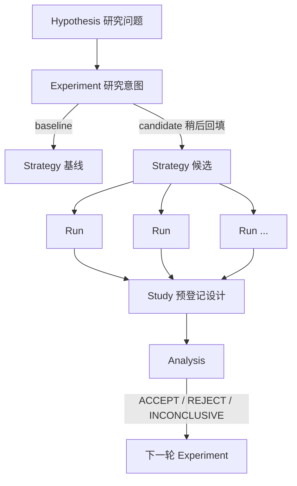

# 小市值策略 Research Registry — v1 设计定稿

> 基于用户提供的 `记录系统设计.md` 原方案评估修订。本文档可独立作为实施依据，不需要对照原方案阅读；改动原因均在正文标注。

## 目录

0. 相对原方案的改动一览
1. 目标与非目标
2. 目录结构
3. 核心对象与关系
4. Schema（SQLite）
5. 归档 Markdown 模板
6. Study 类型与 v1 范围
7. 两级工作流：快速检查点 / 正式实验
8. CLI 设计
9. 历史数据迁移
10. 过拟合防护机制（保留原方案精髓）
11. 实施阶段
12. 需要同步修改的 AGENTS.md
13. v1 十条宪法
14. 已知限制，明确留给 v2

---

## 0. 相对原方案的改动一览

| # | 改动 | 原因 |
|---|---|---|
| 1 | `source_hash`（自建 SHA-256）→ git commit hash + file blob hash，不再需要单独的 hashing.py | 项目已关联 GitHub 仓库并可正常 commit/push，原方案"目录不是 Git 仓库"的判断与 AGENTS.md 矛盾 |
| 2 | `change_scope`/`experiment_level` 只保留在 `experiments` 表，从 `strategies` 表去掉 | 原方案两表都存，S0001 这类无对应 Experiment 的根版本会出现无意义空值，且两处同步有分歧风险 |
| 3 | `experiment_level` 改名为 `validation_tier`（V1-V5） | 与 Analysis 阶段的 `evidence_level`（E0-E6）撞了"E+数字"命名，一个是实验前设定的所需验证严格度，一个是分析后评估的实际证据强度，容易读混 |
| 4 | `experiments.baseline_strategy_id` 补 `NOT NULL` | 原方案文字规则（§33）明确"每个 Experiment 必须有 baseline"，建表语句未强制 |
| 5 | `studies.design_json` 设为 `NOT NULL` | 防过拟合的核心机制——研究设计必须先于结果登记，不该允许留空 |
| 6 | v1 的 Study 类型从 4 种扩到 5 种，加入 `ABLATION` | 原方案 §46 把 Ablation 放入 v2，但 §39 给出的"复杂风控实验"验证方案本身就用到了 Ablation——按原方案范围，最需要严格验证的改动反而验证不了 |
| 7 | Run 的原始聚宽粘贴内容不再复制进 `Rxxxx.md`，改为引用 `聚宽回测结果及运行日志.md` 原文位置 | 避免同一份原始数据存在两处、后续只更新一处导致的漂移 |
| 8 | CLI 全部命令要求支持非交互（flag / JSON payload），新增批量注册命令 | 实际操作者主要是 AI 助手而非人在终端逐项应答交互式提问 |
| 9 | 引入"快速检查点 / 正式实验"两级工作流 | 项目已有两处文档漂移先例（见 §7），给每次代码微调都套完整流程，摩擦大概率重现同类问题 |
| 10 | 明确历史数据迁移方案，含"提到但未粘贴"的 2024/2026 回测如何处理 | 原方案只说了"不要伪造"，未给出具体处理方式 |

---

## 1. 目标与非目标

v1 只解决 6 件事：

1. 现在这份代码是谁（版本 identity）
2. 它从哪个版本派生而来（lineage）
3. 这次改了什么、为什么改（change + rationale）
4. 这份代码跑过哪些聚宽回测（strategy → run 追溯）
5. 一个研究问题涉及哪些回测（run → study 组织）
6. 目前认为这个改动有效 / 无效 / 证据不足（study → analysis 结论）

暂不做：自动提交聚宽、自动拉取聚宽结果、实时交易、在线 Server、Web 前端、自动解析聚宽截图、自动生成复杂 QuantStats 报告。这些延后是对的——当前真正的瓶颈是"实验历史容易失控"，不是"聚宽跑不了自动化"，原方案 §41 这个判断准确，予以保留：

```
实验可追溯性 → 代码可追溯性 → Run 可追溯性 → Study 组织 → 分析 → 可视化 → 自动化聚宽
```

---

## 2. 目录结构

```
小市值/
├── 小市值策略代码.md          # 唯一工作源码，不变
├── 聚宽回测结果及运行日志.md   # 唯一的原始聚宽粘贴内容入口，不变
├── 优化方向.md                # 不变
└── research/
    ├── registry.db             # 结构化数据源头，纳入 git 提交
    ├── README.md                # §13 的十条宪法放这里
    ├── schema.sql
    ├── __init__.py / __main__.py / cli.py / db.py / ids.py
    ├── git_meta.py              # 替代原方案的 hashing.py，封装 git 调用
    ├── strategy.py / hypothesis.py / experiment.py / run.py / study.py / analysis.py
    ├── templates.py / reports.py
    ├── tests/                   # 对应项目已有的 test_export.py 惯例
    │   ├── test_db.py / test_ids.py / test_git_meta.py
    │   ├── test_strategy.py / test_experiment.py
    │   └── test_run.py / test_study.py / test_analysis.py
    ├── strategies/Sxxxx.md
    ├── experiments/Exxxx.md
    ├── runs/Rxxxx.md
    ├── studies/STxxxx.md
    └── analyses/Axxxx.md
```

---

## 3. 核心对象与关系

保留原方案六个核心对象——这部分方法论合理，改动不动概念只动实现：

```text
Strategy   = 代码状态
Experiment = 为什么改（一个研究假设 + 一批共同服务于它的代码修改）
Run        = 一次真实聚宽回测
Study      = 为了回答一个问题，组织的一组 Run（预先登记设计，防止事后凑数据）
Analysis   = 这些 Run 说明什么（结论 + 证据强度）
Hypothesis = 最初想验证什么
```



Strategy 之间"谁是谁的父版本"不再单独维护一套 diff 机制，直接用 git commit 历史回答。

---

## 4. Schema（SQLite）

```sql
-- ============================================================
-- schema.sql — Research Registry v1（修订版）
-- Python 3.12 + SQLite 标准库，符合 AGENTS.md 已确认的环境
-- ============================================================

-- db.py 每次建立连接后必须显式执行，SQLite 默认不强制外键：
-- PRAGMA foreign_keys = ON;
-- 原因：ID 是人工可读字符串（S0024 这类）不是自增整数，打错一位数字
-- （S0024 误写成 S0042）在没开约束时会静默产生一条指向错误策略的记录，
-- 开了约束至少能在 insert 时报错拦下来。

CREATE TABLE strategies (
    strategy_id         TEXT PRIMARY KEY,      -- S0001, S0002, ...
    parent_strategy_id  TEXT,                  -- NULL 表示根版本

    name                 TEXT NOT NULL,
    source_path          TEXT NOT NULL,        -- 固定为 "小市值/小市值策略代码.md"

    git_commit_hash       TEXT NOT NULL,       -- `git rev-parse HEAD`
    file_blob_hash         TEXT NOT NULL,      -- `git hash-object <file>`，内容指纹，
                                                -- 与 commit 解耦，用于识别"内容未变但重复登记"

    change_summary          TEXT,              -- 默认取 git commit message，可在 CLI 中覆盖

    created_at                TEXT NOT NULL,

    FOREIGN KEY (parent_strategy_id) REFERENCES strategies(strategy_id)
);

CREATE TABLE hypotheses (
    hypothesis_id    TEXT PRIMARY KEY,   -- H0001, ...
    title             TEXT NOT NULL,
    description        TEXT NOT NULL,
    expected_effect      TEXT,
    created_at              TEXT NOT NULL
);

CREATE TABLE experiments (
    experiment_id             TEXT PRIMARY KEY,   -- E0001, ...

    hypothesis_id               TEXT,
    baseline_strategy_id          TEXT NOT NULL,   -- 与 §33 文字规则对齐，原方案漏了 NOT NULL
    candidate_strategy_id           TEXT,          -- 允许为空：Experiment 先建立，
                                                    -- Strategy 随后创建后再回填

    title                              TEXT NOT NULL,
    description                          TEXT,

    change_scope                          TEXT NOT NULL,  -- MICRO / SMALL / MEDIUM / LARGE / ARCHITECTURAL
    validation_tier                         TEXT NOT NULL, -- V1 / V2 / V3 / V4 / V5（原名 experiment_level，改名避免和 evidence_level 撞“E”前缀）

    status                                    TEXT NOT NULL DEFAULT 'PLANNED', -- PLANNED / RUNNING / COMPLETED / ABANDONED

    created_at                                  TEXT NOT NULL,

    FOREIGN KEY (hypothesis_id) REFERENCES hypotheses(hypothesis_id),
    FOREIGN KEY (baseline_strategy_id) REFERENCES strategies(strategy_id),
    FOREIGN KEY (candidate_strategy_id) REFERENCES strategies(strategy_id)
);

CREATE TABLE runs (
    run_id             TEXT PRIMARY KEY,   -- R0001, ...

    strategy_id          TEXT NOT NULL,
    experiment_id           TEXT,          -- 允许为空：快速检查点模式下可能没有正式 Experiment

    start_date                TEXT NOT NULL,
    end_date                    TEXT NOT NULL,
    initial_capital                REAL,
    frequency                        TEXT,

    parameters_json                    TEXT,

    status                                TEXT NOT NULL,  -- SUCCESS / FAILED / PARTIAL / INCOMPLETE
                                                            -- INCOMPLETE：已知发生过但原始数据未完整留存（见 §9）

    error_type                              TEXT,          -- 仅 status=FAILED 时填，如 SecurityNotExist / TimeoutError
    error_message                              TEXT,

    source_log_path                              TEXT,     -- 指向聚宽回测结果及运行日志.md 中的具体位置/锚点
    notes                                            TEXT,

    created_at                                        TEXT NOT NULL,

    FOREIGN KEY (strategy_id) REFERENCES strategies(strategy_id),
    FOREIGN KEY (experiment_id) REFERENCES experiments(experiment_id)
);

CREATE TABLE metrics (
    run_id           TEXT NOT NULL,
    metric_name        TEXT NOT NULL,
    metric_value          REAL,
    metric_source            TEXT NOT NULL,  -- joinquant_pasted / derived_local / manual_estimate / secondhand_mention
                                              -- secondhand_mention：数值来自优化方向.md 等二手转述，不可作为 Analysis 证据引用

    PRIMARY KEY (run_id, metric_name),
    FOREIGN KEY (run_id) REFERENCES runs(run_id)
);

CREATE TABLE studies (
    study_id         TEXT PRIMARY KEY,  -- ST0001, ...
    experiment_id      TEXT NOT NULL,

    study_type            TEXT NOT NULL,  -- SINGLE / ROLLING / FACTOR_LAYER / PARAMETER_SWEEP / ABLATION（v1 范围，见 §6）

    name                     TEXT NOT NULL,
    description                 TEXT,

    design_json                    TEXT NOT NULL,  -- 必须在看到 Run 结果前登记，v1 强制 NOT NULL

    created_at                        TEXT NOT NULL,

    FOREIGN KEY (experiment_id) REFERENCES experiments(experiment_id)
);

CREATE TABLE study_runs (
    study_id    TEXT NOT NULL,
    run_id       TEXT NOT NULL,

    group_name    TEXT,
    role           TEXT,   -- baseline / candidate

    PRIMARY KEY (study_id, run_id),
    FOREIGN KEY (study_id) REFERENCES studies(study_id),
    FOREIGN KEY (run_id) REFERENCES runs(run_id)
);

CREATE TABLE analyses (
    analysis_id   TEXT PRIMARY KEY,  -- A0001, ...
    study_id        TEXT NOT NULL,

    conclusion         TEXT,
    decision              TEXT,   -- ACCEPT / REJECT / INCONCLUSIVE / DEFER
    evidence_level           TEXT,  -- E0 ~ E6
    confidence                  REAL,

    report_path                    TEXT,
    created_at                        TEXT NOT NULL,

    FOREIGN KEY (study_id) REFERENCES studies(study_id)
);
```

**`validation_tier`（V1-V5）建议定义**（原方案未给出具体标准，这里补上，避免以后每次填写全凭感觉）：

- `V1`：单次回测即可判断方向，允许快速试错
- `V2`：至少一次 Rolling 多窗口验证
- `V3`：Rolling + 参数扰动（PARAMETER_SWEEP）
- `V4`：因子分层或消融（FACTOR_LAYER / ABLATION）之一
- `V5`：Rolling + Ablation + 参数稳定性组合；`change_scope = ARCHITECTURAL` 的改动默认起步要求 V4

**关键实现要点**：

- `strategy create` 执行前必须确认 `git status` 对 `小市值/小市值策略代码.md` 干净（无未提交改动），否则报错要求先 commit——不然 `git_commit_hash` 对应的内容和硬盘上实际文件内容可能对不上，"用 git 代替自建 hash" 这个改动的价值就没有了。
- `git_commit_hash` 用 `git rev-parse HEAD` 取，`file_blob_hash` 用 `git hash-object 小市值/小市值策略代码.md` 取，都是 subprocess 调用标准 git 命令。要看两个版本间具体改了什么，`git diff <hash1> <hash2> -- 小市值/小市值策略代码.md` 直接可用，比原方案手填 `changed_modules` 列表更可靠、不会遗漏。
- `file_blob_hash` 相同时（内容没变但又跑了一次 `strategy create`），CLI 应给出警告而非静默通过或强制拒绝——留给用户判断是否是有意的重新登记（比如回退到某个历史状态）。

---

## 5. 归档 Markdown 模板

### `strategies/S0024.md`

```markdown
# S0024

## 基本信息
- Parent: S0023
- Git Commit: <hash>
- File Blob Hash: <hash>
- Created: 2026-08-18

## 变化
增加指数趋势风控。

## 关联实验
- E0008（若为快速检查点，此项留空）

## 关联回测
- R0152
- R0153
```

### `experiments/E0008.md`

```markdown
# E0008

## 核心假设
加入指数趋势风控可以降低系统性回撤。

## Baseline / Candidate
- Baseline: S0023
- Candidate: S0024

## Change Scope / Validation Tier
- Change Scope: LARGE
- Validation Tier: V4

## 预期
- Max Drawdown ↓
- Sharpe 不显著下降

## 验证计划
1. Rolling
2. Ablation
3. 参数稳定性

## 当前状态
RUNNING
```

### `runs/R0152.md`

```markdown
# R0152

## Strategy / Experiment
- Strategy: S0024
- Experiment: E0008

## Backtest 设置
- Start: 2020-01-01
- End: 2021-01-01
- Initial Capital: 1,000,000
- Frequency: daily

## Parameters
```yaml
rebalance_days: 5
```

## Status
SUCCESS

## Metrics

| 指标 | 数值 | 来源 |
|---|---|---|
| Annual Return | ... | joinquant_pasted |
| Max Drawdown | ... | joinquant_pasted |
| Sharpe | ... | joinquant_pasted |

## 原始数据位置
见 `聚宽回测结果及运行日志.md` 对应条目（按日期或锚点定位，不在此重复粘贴，避免两处数据不同步）

## Notes
...
```

---

## 6. Study 类型与 v1 范围

v1 实现 5 种（原方案 4 种，补充 `ABLATION`）：

- `SINGLE` — 单次回测
- `ROLLING` — 滚动时间窗口
- `FACTOR_LAYER` — 因子分层
- `PARAMETER_SWEEP` — 参数扫描
- `ABLATION` — 消融实验（逐一开关某个组件）

`WALK_FORWARD`、`OOS` 留到 v2——这两种需要专门实现"滚动切分训练/验证窗口"的逻辑，工作量明显大于其余五种；而 Ablation 本质上和已在 v1 范围内的 `PARAMETER_SWEEP`/`FACTOR_LAYER` 是同一种"沿一个维度分组、跑多个 Run"的机制，复用现成的 `study_runs` 分组能力即可，不需要额外开发。

这个调整是必须的：原方案 §39 给"指数趋势风控+贝叶斯+在线辨识"这个 `ARCHITECTURAL` 级改动设计验证方案时，本身就用到了 Ablation（ST0101）；而 §46 又把 Ablation 排除在 v1 之外。按原方案的 v1 范围，这个例子里被反复强调"必须最严格验证"的改动，恰恰是 v1 系统没法完整验证的。

`Study design` 模板（沿用原方案，示例）：

```yaml
type: ABLATION
base: full
components:
  - trend
  - bayesian
  - online_identification
```

---

## 7. 两级工作流：快速检查点 / 正式实验

**背景**：AGENTS.md 里记着两处文档漂移的实例——回测日志文件停留在 2021 年的旧数据，2024/2026 年的新回测只在优化方向.md 里用文字提了一句，没有把结果粘回日志文件；优化方向.md 写着"当前策略不设流动性约束"，但代码其实已经实现了换手率过滤。哪怕只维护"代码+结果日志+待办"三个文件，同步都没能完全跟上。如果新系统要求每次哪怕很小的代码尝试都先建 Hypothesis、走完整 Experiment 流程，摩擦大概率重现同样的问题——而且量级更大，从两个文件的漂移变成五类对象、八张表的漂移。

**方案**：

- **快速检查点**（探索阶段用）：

  ```powershell
  python -m research strategy create --quick --parent S0023 --summary "试一下调仓改10天，先看看方向对不对"
  ```

  只需要 parent 和一句话摘要，git 哈希自动带上，不要求挂 Hypothesis/Experiment/scope/tier。回答的是"这份代码是谁、从哪来"这两个最基本的问题，摩擦接近于"平时 commit 代码写一句 message"。

- **正式实验**（决定要系统验证时用）：完整的 Hypothesis → Experiment → Study → Analysis 链条，即原方案的核心设计，不变。

- **升级路径**：某个快速检查点的方向看着有戏，值得认真验证时，用已有的 Strategy 回填一个 Experiment：

  ```powershell
  python -m research experiment create `
    --hypothesis H0012 --baseline S0023 --candidate S0024 `
    --title "调仓周期延长" --scope MICRO --tier V2
  ```

  `--candidate S0024` 指向的正是之前 quick 模式建的那个 Strategy，不需要重新创建代码版本，命令内部只是对 `experiments` 表做一次 INSERT 并回填 `strategies` 与之关联的展示信息。

---

## 8. CLI 设计

**设计前提**：原方案 §40 自己描述的工作流里，从读 AGENTS.md、建 Hypothesis 到登记 Run，基本都是"AI 应该做"的步骤，人只负责复制代码到聚宽、跑回测、把结果贴回来。既然主要操作者是 AI 助手，CLI 的一等接口就必须是非交互式的（flag 或一次性 JSON payload），不能是逐字段等终端输入的交互式向导——AI agent 没法可靠地一步步应答那种问答式提示。交互向导可以作为人工直接使用时的可选便利层，但不能是唯一形态。

```powershell
# 初始化
python -m research init

# 创建策略版本（非交互；执行前校验工作区无未提交改动）
python -m research strategy create `
  --parent S0023 --experiment E0008 `
  --summary "增加指数趋势风控，风险状态下降低目标仓位"

# 快速检查点（见 §7）
python -m research strategy create --quick --parent S0023 --summary "..."

# 查看
python -m research strategy show S0024
python -m research strategy tree S0001      # 文本树

# 假设与实验
python -m research hypothesis create --title "..." --description "..." --expected "Max Drawdown 下降"
python -m research experiment create `
  --hypothesis H0010 --baseline S0020 `
  --title "指数趋势风控" --scope ARCHITECTURAL --tier V5

# 登记一次聚宽回测：flag 形式（少量指标时）
python -m research run create `
  --strategy S0024 --experiment E0008 `
  --start 2020-01-01 --end 2021-01-01 --capital 1000000 --status SUCCESS `
  --metric annual_return=0.213 --metric sharpe=1.52 --metric max_drawdown=0.174

# 失败回测同样要登记，不得删除
python -m research run create `
  --strategy S0024 --start 2020-01-01 --end 2021-01-01 `
  --status FAILED --error-type SecurityNotExist --error-message "..."

# 登记一次聚宽回测：JSON payload 形式（复杂/批量场景优先用这个）
python -m research run create --from-json run_R0152.json

# Study：批量把 Rolling 窗口的 Run 一次性建好并加入，避免逐条调用
python -m research study create --experiment E0008 --type ROLLING --name "5窗口滚动验证" --design rolling_design.json
python -m research study batch-add-runs ST0012 --from-json rolling_runs.json
python -m research study show ST0012

# 分析
python -m research analyze ST0012           # 输出统计 + 5 项过拟合诊断 WARNING
python -m research analysis create --study ST0012 --decision ACCEPT --evidence E2 --conclusion "..."
```

`rolling_runs.json` 示例（`study batch-add-runs` 的输入，一次创建 N 个 Run + 写入各自 metrics + 加入 Study，取代逐条 `run create` + `run add-metric`）：

```json
[
  {
    "strategy": "S0024", "start": "2020-01-01", "end": "2021-01-01",
    "capital": 1000000, "status": "SUCCESS",
    "group": "2020-2021", "role": "candidate",
    "metrics": {"annual_return": 0.18, "sharpe": 1.3, "max_drawdown": 0.15}
  },
  {
    "strategy": "S0010", "start": "2020-01-01", "end": "2021-01-01",
    "capital": 1000000, "status": "SUCCESS",
    "group": "2020-2021", "role": "baseline",
    "metrics": {"annual_return": 0.14, "sharpe": 1.1, "max_drawdown": 0.19}
  }
]
```

原方案 Rolling 例子（6 个窗口）如果每个窗口都走"run create + N 次 add-metric"，一次 Study 登记要三四十次调用；批量命令把这个数量级压下来。

---

## 9. 历史数据迁移

**已有的 2021-01~02 回测（7 次调仓，已完整粘贴在聚宽回测结果及运行日志.md）**：

- 检查 git 历史是否覆盖到当时的代码状态。大概率不覆盖（项目"建仓"是 2026-08-18）——这种情况下创建一个明确标注 `HISTORICAL_UNVERSIONED` 的占位 Strategy（`git_commit_hash`/`file_blob_hash` 填当前 commit，`notes` 注明"早期代码状态未做版本追溯，此 Run 仅作历史记录，不代表当前代码"），避免编造一个当时并不存在的精确 hash。
- 按 `聚宽回测结果及运行日志.md` 中真实出现的数据逐条创建 Run + metrics，`source_log_path` 直接指向该文件对应位置，不重新粘贴一份到 `research/runs/`。

**2024-01 / 2026-05 / 2026-07 提到但未完整粘贴的记录**：

- 创建 Run 记录，`status = 'INCOMPLETE'`；`metrics` 留空，或记录已知数值但显式标注 `metric_source = 'secondhand_mention'`（而非 `joinquant_pasted`）；`notes` 写明"数值转述自优化方向.md，非聚宽原始粘贴，分析时不可直接引用，需在聚宽平台复核并补齐粘贴后更新为 joinquant_pasted"。
- 这样时间线不会凭空消失，也不会把不可靠数字当成可信证据用于 Analysis——这一点原方案结尾已经有正确的直觉（"不应把未实际粘贴的摘要伪造成 Run"），这里给出的是具体落地方式。

---

## 10. 过拟合防护机制（保留原方案精髓）

这部分是原方案里方法论最扎实的部分，不需要大改：

- **Evidence Level**（E0-E6）：从"尚未验证"到"跨多个市场环境验证"，明确"不是策略等级，是结论目前有多少证据支持"。
- **5 个过拟合诊断指标**：Window Stability / Parameter Stability / Factor Monotonicity / IS-OOS Gap / Best-vs-Median Gap。
- v1 只输出 WARNING，不自动下"过拟合"结论，最终判断留给 Analysis 记录的人工/AI 决策：

  ```text
  Overfitting Signals:
  [WARN] 最优参数显著优于中位数
  [WARN] OOS Sharpe 明显低于 IS
  [OK]   多窗口方向一致
  [OK]   因子层级近似单调
  ```

- `baseline_strategy_id` 强制存在（现已在 schema 层面用 `NOT NULL` 约束），任何比较都有锚点，不会出现"S0011 比哪个版本好"这种模糊问法。

---

## 11. 实施阶段

### Phase 1：Registry 基础设施
`schema.sql`（含 `PRAGMA foreign_keys = ON`）、`db.py`、`ids.py`（按前缀查 `MAX+1` 生成下一个 ID，单进程本地场景不需要处理并发）、`git_meta.py`（封装 `git rev-parse` / `git hash-object` / `git log` / `git diff`，全部走 subprocess，替代原方案的 hashing.py）。
测试：`test_db.py`、`test_ids.py`、`test_git_meta.py`。

### Phase 2：Strategy
`strategy create`（非交互，flag 驱动；创建前校验工作区无未提交改动）、`strategy show`、`strategy tree`。
测试：`test_strategy.py`。

### Phase 3：Hypothesis + Experiment
`hypothesis create`、`experiment create`（校验 `baseline_strategy_id` 存在）、`experiment show` / `experiment list --status RUNNING`。
测试：`test_experiment.py`。

### Phase 4：Run
`run create`（支持 `--from-json` 一次性带入 metrics；支持 FAILED 状态 + error_type/error_message）、`run add-metric`（补充单个指标用）、`run show`。
测试：`test_run.py`。

### Phase 5：Study
`study create`（`design_json` 必填）、`study add-run` / `study batch-add-runs`、`study show`；实现 SINGLE / ROLLING / FACTOR_LAYER / PARAMETER_SWEEP / ABLATION 五种。
测试：`test_study.py`。

### Phase 6：Analysis
`analyze STxxxx`（先出统计：mean/median/std/min/max/positive_ratio/baseline_delta + 5 项过拟合诊断 WARNING）、`analysis create`（记录 decision + evidence_level + conclusion）。
测试：`test_analysis.py`。

### Phase 7：Markdown 生成 + 历史迁移 + AGENTS.md 联动
数据库 → Markdown 自动生成（5 类文件）；"快速检查点 → 正式实验"的 promote 命令；按 §9 一次性运行历史数据迁移；更新 AGENTS.md（见 §12）。

---

## 12. 需要同步修改的 AGENTS.md

系统上线后，AGENTS.md 若不同步更新，下一次 AI 会话读到的仍是旧工作流——"读取 AGENTS.md" 本身就是原方案 §40 工作流的第一步，AGENTS.md 是实际的入口文档。至少需要：

- "目录结构"一节补充 `research/` 子目录说明
- "小市值策略"一节的工作流描述改为引用 `research/README.md`（十条宪法），并说明两级工作流（快速检查点 / 正式实验）
- "常用命令"一节补充 `python -m research ...` 系列命令
- 补一条操作前提："登记 Strategy 前须先 `git commit` 该代码文件"
- 保留现有规则"评价策略效果只准引用聚宽回测结果及运行日志.md 内容"，并说明该规则通过 `metrics.metric_source` 枚举（`joinquant_pasted` 才可作为 Analysis 证据）在新系统里如何被延续

---

## 13. v1 十条宪法

供 `research/README.md` 使用：

1. `小市值策略代码.md` 是唯一工作源码；每次登记 Strategy 前必须先 `git commit` 该文件，确保 `git_commit_hash` 对应的就是硬盘上的实际内容。
2. Strategy Version 表示代码状态，不表示成功与否；快速检查点与正式实验版本都是合法的 Strategy，用是否挂载了 Experiment 区分。
3. Experiment 表示一个研究假设；`change_scope` 描述代码改动范围，`validation_tier` 描述需要多严格的验证，两者不必然相关（一行代码的改动也可能需要 V5 级验证）。
4. 一个 Experiment 可以包含多个代码修改，但这些修改必须共同服务于同一个核心假设；独立假设必须拆成不同 Experiment。
5. Run 表示一次实际聚宽回测，必须允许 FAILED 和 INCOMPLETE，不得删除，包括不成功和数据不全的记录。
6. Metric 与 Run 结构分离存储；每条 Metric 必须标注来源，二手转述的数字不得标记为 `joinquant_pasted`。
7. Study 的 `design_json` 必须在看到 Run 结果之前登记，不允许事后调整分组/窗口来配合已经看到的结果。
8. Study 与 Run 是多对多关系；Strategy、Experiment、Run、Study、Analysis 全部可互相追溯，Strategy 的谱系以 git commit 为准，不重复发明 diff 机制。
9. Analysis 的 decision 必须区分"结果事实"和"研究判断"：单次漂亮回测不能直接宣布策略有效，`ARCHITECTURAL` 级别的改动在 Ablation/Rolling 类 Study 完成前不得给出 ACCEPT。
10. 一切 CLI 命令必须支持非交互（flag 或 JSON payload）调用，因为主要操作者是 AI 助手而非人工在终端逐项应答。

---

## 14. 已知限制，明确留给 v2

- `WALK_FORWARD`、`OOS` study 类型：需要实现滚动切分训练/验证窗口的专门逻辑，比 Ablation 复杂，v1 不做。
- Schema 迁移机制未设计：v1 阶段新增字段用 `ALTER TABLE ADD COLUMN` 够用；涉及删除/改名字段需要重建表，届时再补迁移脚本。
- 若"个人量化研究平台"（数据层等，你之前提到正在单独调研搭建）以后覆盖不止小市值这一只策略，考虑给 `strategies`/`experiments` 加一个 `project`/`strategy_family` 维度——现在加成本很低，以后补代价更高。
- 同一次聚宽回测被回填/追加新数据（比如日志中途更新）的情况尚未设计处理方式，出现时先当新 Run 处理，不做 merge。
