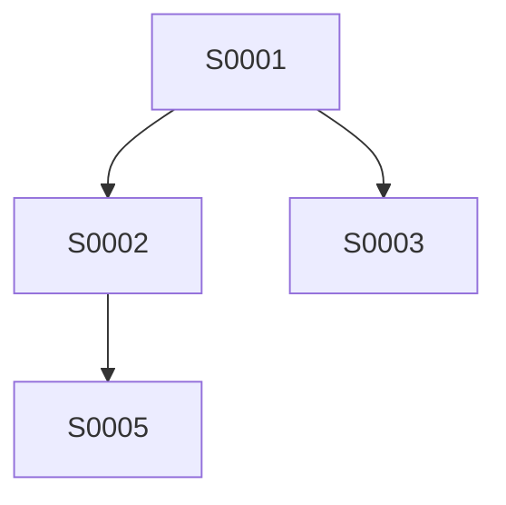

建议现在直接把 v1 定义成一个**“研究登记系统（Research Registry）”**，而不是一开始就做完整的 MLflow 替代品。

你当前的工作流已经很明确：源码只有一份，回测仍然由你手工复制到聚宽执行，结果再回贴本地；实验规则为“一个实验围绕一个核心假设，允许多个实现性代码修改”。

下面这个 v1，我建议做到以后你每天都可以用，而不是做成一个“设计得很好但维护成本很高”的系统。

---

# 1. v1 的目标

v1 只解决 6 件事情：

```text
1. 我现在这份代码是谁？
2. 它是从哪个策略版本来的？
3. 这次到底改了什么、为什么改？
4. 这份代码跑过哪些聚宽回测？
5. 一个研究问题涉及哪些回测？
6. 到目前为止，我们认为这个改动“有效 / 无效 / 证据不足”吗？
```

暂时**不解决**：

```text
- 自动提交聚宽
- 自动拉取聚宽结果
- 实时交易
- 在线 MLflow Server
- Web 前端
- 自动解析所有聚宽截图
- 自动生成非常复杂的 QuantStats 报告
```

这些都可以以后加。

---

# 2. v1 的总体结构

我建议最终目录直接变成这样：

```text
小市值/
│
├── 小市值策略代码.md
├── 聚宽回测结果及运行日志.md
├── 优化方向.md
│
└── research/
    │
    ├── registry.db
    ├── README.md
    │
    ├── strategies/
    │   └── S0001.md
    │
    ├── experiments/
    │   └── E0001.md
    │
    ├── runs/
    │   ├── R0001.md
    │   └── R0002.md
    │
    ├── studies/
    │   └── ST0001.md
    │
    ├── analyses/
    │   └── A0001.md
    │
    └── reports/
        └── ST0001.md
```

这里最重要的是：

### `小市值策略代码.md`

仍然是**唯一工作源码**。

这符合现在 AGENTS.md 的既有约定。

### `research/`

是**研究历史和实验数据库**。

不要再复制出第二份“正在编辑的策略代码”。

---

# 3. v1 的核心对象只有 6 个

我建议：

```text
Strategy
Experiment
Run
Study
Analysis
Hypothesis
```

其中：

```text
Strategy = “代码状态”
Experiment = “为什么改”
Run = “实际跑了一次什么”
Study = “为了回答一个问题，组织了哪些 Run”
Analysis = “这些 Run 说明什么”
Hypothesis = “我们原本想验证什么”
```

---

# 4. Strategy：策略版本

这是最基础的一层。

例如：

```text
S0001
基础小市值策略

S0002
增加流动性约束

S0003
调仓 5 → 10 日

S0004
增加趋势风控
```

但注意：

> `S0004` 不叫“改进版 S0003”。

它只是：

> **基于 S0003 派生出来的新代码状态。**

成功不成功由后面的 Experiment / Analysis 决定。

---

# 5. Strategy 表

SQLite 第一版可以这样：

```sql
CREATE TABLE strategies (
    strategy_id TEXT PRIMARY KEY,
    parent_strategy_id TEXT,

    name TEXT NOT NULL,

    source_path TEXT NOT NULL,
    source_hash TEXT NOT NULL,

    change_summary TEXT,
    change_scope TEXT,
    experiment_level TEXT,

    created_at TEXT NOT NULL,

    FOREIGN KEY (parent_strategy_id)
        REFERENCES strategies(strategy_id)
);
```

推荐枚举：

### `change_scope`

```text
MICRO
SMALL
MEDIUM
LARGE
ARCHITECTURAL
```

### `experiment_level`

```text
E1
E2
E3
E4
E5
```

不用把等级搞得非常复杂。

---

# 6. source_hash 是 v1 必须做的

这是我认为整个系统里最值得第一天就实现的东西。

每次创建 Strategy：

```text
读取：
小市值/小市值策略代码.md

计算：
SHA-256

记录：
source_hash
```

例如：

```text
S0024
source_hash = 8fa1d...
```

这样以后你能回答：

> “R0123 这个聚宽回测，到底对应哪一份代码？”

通过：

```text
R0123
→ S0024
→ source_hash
```

就能追溯。

---

# 7. 但是 hash 还不够：要记录 Diff

每个 Strategy Version 同时保存：

```text
parent_strategy_id
change_summary
changed_modules
```

例如：

```yaml
strategy_id: S0024
parent_strategy_id: S0023

change_scope: LARGE
experiment_level: E4

change_summary: >
  增加指数趋势风控，在风险状态下
  降低股票目标仓位。

changed_modules:
  - market_regime
  - risk_control
  - position_sizing
```

第一版甚至不需要保存完整 git diff。

因为你的目录明确不是 Git 仓库，而且当前 AGENTS.md 也明确要求不要初始化 Git。

可以使用：

```text
before_hash
after_hash
```

再加一个人工 `change_summary`。

以后再增加 AST/diff 工具。

---

# 8. Hypothesis：不要省掉

我建议从 v1 就有。

比如：

```text
H0001

问题：
降低调仓频率是否能够减少交易成本，
同时不显著降低策略收益？
```

或者：

```text
H0002

问题：
加入指数趋势风控后，
系统性下跌阶段的最大回撤是否下降？
```

字段：

```sql
CREATE TABLE hypotheses (
    hypothesis_id TEXT PRIMARY KEY,

    title TEXT NOT NULL,
    description TEXT NOT NULL,

    expected_effect TEXT,

    created_at TEXT NOT NULL
);
```

---

# 9. Experiment：真正替代“一次只改一处”的东西

一个 Experiment 对应：

> **一次研究意图。**

例如：

```text
E0008

假设：
增加趋势风控能够降低系统性回撤。

变更：
新增市场趋势判断
新增风险状态
新增动态目标仓位

预期：
Max Drawdown ↓
Sharpe ↑/不明显下降
```

Schema：

```sql
CREATE TABLE experiments (
    experiment_id TEXT PRIMARY KEY,

    hypothesis_id TEXT,

    baseline_strategy_id TEXT,
    candidate_strategy_id TEXT,

    title TEXT NOT NULL,
    description TEXT,

    change_scope TEXT NOT NULL,
    experiment_level TEXT NOT NULL,

    status TEXT NOT NULL,

    created_at TEXT NOT NULL,

    FOREIGN KEY (hypothesis_id)
        REFERENCES hypotheses(hypothesis_id),

    FOREIGN KEY (baseline_strategy_id)
        REFERENCES strategies(strategy_id),

    FOREIGN KEY (candidate_strategy_id)
        REFERENCES strategies(strategy_id)
);
```

---

# 10. Experiment 的 status

v1 建议就这几个：

```text
PLANNED
RUNNING
COMPLETED
ABANDONED
```

不要设计成：

```text
GOOD
BAD
```

因为“好不好”是 Analysis 的结论。

---

# 11. Run：一次真实聚宽回测

这是最重要的一张表。

例如：

```text
R0152

Strategy:
S0024

Experiment:
E0008

Start:
2020-01-01

End:
2021-01-01

Initial Capital:
1000000

Status:
SUCCESS
```

Schema：

```sql
CREATE TABLE runs (
    run_id TEXT PRIMARY KEY,

    strategy_id TEXT NOT NULL,
    experiment_id TEXT,

    start_date TEXT NOT NULL,
    end_date TEXT NOT NULL,

    initial_capital REAL,

    frequency TEXT,

    parameters_json TEXT,

    status TEXT NOT NULL,

    source_log_path TEXT,

    notes TEXT,

    created_at TEXT NOT NULL,

    FOREIGN KEY (strategy_id)
        REFERENCES strategies(strategy_id),

    FOREIGN KEY (experiment_id)
        REFERENCES experiments(experiment_id)
);
```

---

# 12. Run 必须允许 FAILED

这点非常重要。

例如：

```text
R0153
status = FAILED

error_type:
SecurityNotExist

error_message:
...
```

不要删除。

因为失败回测也是研究历史。

而且你当前 AGENTS.md 已经有相当详细的 JoinQuant 错误语义，例如 `SecurityNotExist`、`TimeoutError`、下单数量为 0、跌停卖单撤销等，这些未来都可以进入自动诊断。

---

# 13. Metric：不要把指标直接写死在 runs 表里

不要：

```sql
annual_return
sharpe
max_drawdown
volatility
...
```

全部堆在 `runs`。

因为以后一定还会增加：

```text
turnover
win_rate
profit_loss_ratio
calmar
tail_ratio
beta
alpha
exposure
...
```

因此单独一张：

```sql
CREATE TABLE metrics (
    run_id TEXT NOT NULL,

    metric_name TEXT NOT NULL,
    metric_value REAL,

    metric_source TEXT,

    PRIMARY KEY (run_id, metric_name),

    FOREIGN KEY (run_id)
        REFERENCES runs(run_id)
);
```

例如：

```text
R0152

annual_return     0.213
max_drawdown      0.174
sharpe            1.52
volatility        0.21
```

---

# 14. 这里要特别区分“Run”与“Study”

这是你前面提出问题时最重要的一点，现在把它落实成数据结构。

比如你要测试：

```text
2020-2021
2021-2022
2022-2023
2023-2024
2024-2025
2025-2026
```

这不是一个 Run。

而是：

```text
Study ST0010
    ├── R0101
    ├── R0102
    ├── R0103
    ├── R0104
    ├── R0105
    └── R0106
```

---

# 15. Study 是整个系统的关键抽象

Schema：

```sql
CREATE TABLE studies (
    study_id TEXT PRIMARY KEY,

    experiment_id TEXT NOT NULL,

    study_type TEXT NOT NULL,

    name TEXT NOT NULL,
    description TEXT,

    design_json TEXT,

    created_at TEXT NOT NULL,

    FOREIGN KEY (experiment_id)
        REFERENCES experiments(experiment_id)
);
```

`study_type` 第一版固定这几个：

```text
SINGLE
ROLLING
FACTOR_LAYER
PARAMETER_SWEEP
ABLATION
WALK_FORWARD
OOS
```

以后可以扩。

---

# 16. Study 和 Run 是多对多关系

不要直接：

```text
runs.study_id
```

因为以后同一个 Run 可能用于多个 Study。

例如：

```text
R0123
```

既可以参加：

```text
ST0010 Rolling Stability
```

也可以参加：

```text
ST0020 Factor Analysis
```

所以单独建立：

```sql
CREATE TABLE study_runs (
    study_id TEXT NOT NULL,
    run_id TEXT NOT NULL,

    group_name TEXT,
    role TEXT,

    PRIMARY KEY (study_id, run_id),

    FOREIGN KEY (study_id)
        REFERENCES studies(study_id),

    FOREIGN KEY (run_id)
        REFERENCES runs(run_id)
);
```

这个设计会非常值。

---

# 17. group_name 解决你的“15-30、31-45”问题

例如：

```text
Study:
ST0021

type:
FACTOR_LAYER
```

Study design：

```json
{
  "factor": "small_cap_rank",
  "groups": [
    "1-15",
    "16-30",
    "31-45"
  ]
}
```

然后：

```text
study_runs

ST0021 / R0201 / group=1-15
ST0021 / R0202 / group=16-30
ST0021 / R0203 / group=31-45
```

完全不会和策略版本混在一起。

---

# 18. Study design 一定要保存“实验设计”

这是防止过拟合的关键之一。

例如：

```json
{
  "study_type": "ROLLING",

  "window": "1Y",

  "step": "1Y",

  "period_selection": "predefined",

  "periods": [
    ["2020-01-01", "2021-01-01"],
    ["2021-01-01", "2022-01-01"],
    ["2022-01-01", "2023-01-01"]
  ]
}
```

这样以后看到结果时，你知道：

> 这些年份不是看到结果之后挑出来的，而是 Study 创建时就规定好的。

---

# 19. Analysis：研究结论单独存

Schema：

```sql
CREATE TABLE analyses (
    analysis_id TEXT PRIMARY KEY,

    study_id TEXT NOT NULL,

    conclusion TEXT,
    decision TEXT,

    evidence_level TEXT,

    confidence REAL,

    created_at TEXT NOT NULL,

    report_path TEXT,

    FOREIGN KEY (study_id)
        REFERENCES studies(study_id)
);
```

`decision`：

```text
ACCEPT
REJECT
INCONCLUSIVE
DEFER
```

`evidence_level`：

```text
E0
E1
E2
E3
E4
E5
E6
```

---

# 20. v1 的 Evidence Level 我建议这样定义

```text
E0
尚未验证

E1
单次回测支持

E2
多个时间窗口支持

E3
参数扰动后仍支持

E4
因子/分层实验支持

E5
OOS / Walk-forward 支持

E6
跨多个市场环境/数据条件支持
```

注意：

**Evidence Level 不是“策略等级”。**

它描述的是：

> 对某个研究结论，目前有多强的证据。

---

# 21. 这就能形成完整的追溯链

例如：

```text
Analysis A0012
       ↓
Study ST0012
       ↓
Experiment E0031
       ↓
Hypothesis H0015
       ↓
Candidate Strategy S0042
       ↓
Parent Strategy S0038
       ↓
Source Hash
       ↓
小市值/小市值策略代码.md
```

反方向也一样：

```text
Strategy S0038
   ↓
有哪些 Experiment？
   ↓
哪些 Run？
   ↓
哪些 Study？
   ↓
最终结论是什么？
```

这就是你最开始想要的“树状图”真正应该实现的功能。

---

# 22. v1 的完整 SQLite Schema

我建议第一版就 7 张表：

```text
strategies
hypotheses
experiments
runs
metrics
studies
study_runs
analyses
```

严格说是 8 张。

关系如下：

```text
Hypothesis
    │
    ↓
Experiment
    │
    ├──────────────→ baseline Strategy
    │
    └──────────────→ candidate Strategy
                         │
                         ↓
                       Runs
                         │
                   ┌─────┴─────┐
                   ↓           ↓
               Study A      Study B
                   │           │
                   └─────┬─────┘
                         ↓
                      Analysis
```

---

# 23. 目录中的 Markdown 文件应该做什么？

数据库是机器真相。

Markdown 是**人和 AI 的阅读界面**。

这一点很重要。

例如：

`research/strategies/S0024.md`

内容：

```markdown
# S0024

## 基本信息

- Parent: S0023
- Change Scope: LARGE
- Experiment Level: E4
- Source Hash: ...
- Created: 2026-08-18

## 变化

增加指数趋势风控。

## 研究目的

降低系统性下跌阶段的回撤。

## 相关实验

- E0008

## 相关回测

- R0152
- R0153
- R0154
```

---

# 24. Experiment Markdown

例如：

```markdown
# E0008

## 核心假设

加入指数趋势风控可以降低系统性回撤。

## Baseline

S0023

## Candidate

S0024

## Change Scope

LARGE

## Experiment Level

E4

## 预期

- Max Drawdown ↓
- Sharpe 不显著下降
- 收益不出现结构性下降

## 验证计划

1. Rolling
2. Ablation
3. 参数稳定性

## 当前状态

RUNNING
```

---

# 25. Run Markdown

聚宽每次回测都会生成一个：

```text
R0152.md
```

建议固定格式：

````markdown
# R0152

## Strategy

S0024

## Experiment

E0008

## Backtest

- Start: 2020-01-01
- End: 2021-01-01
- Initial Capital: 1,000,000
- Frequency: daily

## Parameters

```yaml
rebalance_days: 5
small_rank: 1-15
large_rank: 1-15
````

## Status

SUCCESS

## Metrics

* Annual Return:
* Max Drawdown:
* Sharpe:
* Volatility:

## JoinQuant Result

原始回测结果粘贴或摘要。

## Logs

原始日志。

## Notes

...

````

---

# 26. 为什么保留 Run Markdown，而不是只留 SQLite？

因为你现在的回测结果还是**人工从聚宽复制回来**。

所以：

```text
SQLite
````

负责结构化数据。

而：

```text
R0001.md
```

负责保存原始上下文。

以后即使解析器写错了：

```text
SQLite = 1.52 Sharpe
```

而原始 Run Markdown 里还有：

```text
聚宽原始结果
```

可以重新解析。

这是非常重要的数据可追溯性。

---

# 27. `聚宽回测结果及运行日志.md` 应该继续存在

这一点不要推翻。

AGENTS.md 已经规定：

> 这个文件是用户把平台回测结果和日志粘贴回本地的入口，而且评价效果时只允许引用里面真实出现的数据。

所以 v1 可以采用：

```text
聚宽
 ↓
复制结果
 ↓
聚宽回测结果及运行日志.md
 ↓
research CLI
 ↓
Rxxxx.md
 ↓
registry.db
```

以后再考虑直接让 AI 从这份文件中提取 Run。

---

# 28. v1 CLI，我建议只做 10 个命令

不要搞得太复杂。

例如：

```powershell
python -m research init
```

初始化数据库。

---

```powershell
python -m research strategy create
```

创建 Strategy。

---

```powershell
python -m research strategy show S0024
```

查看版本。

---

```powershell
python -m research experiment create
```

创建 Experiment。

---

```powershell
python -m research run create
```

登记一次聚宽回测。

---

```powershell
python -m research run show R0152
```

查看一次回测。

---

```powershell
python -m research study create
```

创建 Study。

---

```powershell
python -m research study add-run ST0012 R0152
```

把 Run 加入 Study。

---

```powershell
python -m research study show ST0012
```

查看 Study。

---

```powershell
python -m research analyze ST0012
```

生成分析结果。

第一版够用了。

---

# 29. CLI 最重要的不是方便，而是强制结构

比如你创建 Experiment：

```text
python -m research experiment create
```

它要求：

```text
Hypothesis:
Baseline:
Candidate:
Change Scope:
Experiment Level:
```

这样就不会出现：

> “我刚才改了一点代码，先跑跑看。”

而会形成：

```text
H0012
↓
E0032
↓
S0041
↓
Run
```

这就是研究纪律。

---

# 30. 创建 Strategy 时自动做的事情

推荐：

```text
research strategy create
```

自动：

```text
1. 读取当前源码
2. SHA256
3. 分配 Sxxxx
4. 要求选择 parent
5. 要求填写 change summary
6. 要求填写 scope
7. 要求填写 experiment level
8. 写入 strategies
9. 创建 strategies/Sxxxx.md
```

---

# 31. 创建 Run 时自动做的事情

例如：

```text
research run create
```

自动询问：

```text
Strategy:
S0024

Experiment:
E0008

Start:
2020-01-01

End:
2021-01-01

Initial Capital:
1000000
```

然后：

```text
R0152
```

写入数据库。

---

# 32. 对你最有价值的是 Study 模板

你以后大多数研究其实都会落入固定模式。

## Rolling

```yaml
type: ROLLING

window: 1Y
step: 1Y

periods:
  - 2020-2021
  - 2021-2022
  - 2022-2023
  - 2023-2024
  - 2024-2025
  - 2025-2026
```

---

## Factor Layer

```yaml
type: FACTOR_LAYER

factor: market_cap_rank

groups:
  - 1-15
  - 16-30
  - 31-45
```

---

## Parameter Sweep

```yaml
type: PARAMETER_SWEEP

parameter: rebalance_days

values:
  - 3
  - 5
  - 10
  - 15
  - 20
```

---

## Ablation

```yaml
type: ABLATION

base: full

components:
  - trend
  - bayesian
  - online_identification
```

这四种 Study 就已经覆盖你目前大部分需求。

---

# 33. 一个非常重要的规则：Baseline 必须固定

每个 Experiment 都必须有：

```text
baseline_strategy_id
```

例如：

```text
E0021

Baseline:
S0010

Candidate:
S0011
```

这样你以后不会出现：

> “S0011 比哪一个版本好？”

所有比较都是有锚点的。

---

# 34. Study 可以比较多个策略，但 Experiment 不要混乱

例如：

```text
E0021
趋势风控实验

Baseline:
S0010

Candidate:
S0011
```

然后：

```text
ST0041
Rolling Study
```

组织：

```text
S0010 / 2020
S0010 / 2021
S0010 / 2022

S0011 / 2020
S0011 / 2021
S0011 / 2022
```

最终就可以严格比较：

```text
candidate - baseline
```

而不是比较两个孤立的收益率。

---

# 35. v1 分析模块先别做得太“聪明”

第一版 `analyze` 只做客观统计：

### 跨时间窗口

```text
mean
median
std
min
max
positive_ratio
```

### Candidate vs Baseline

```text
delta_return
delta_drawdown
delta_sharpe
```

### 稳定性

```text
window_consistency
```

### Factor Layer

```text
rank correlation
monotonicity
best_group
worst_group
```

不要 v1 就做：

> “AI 判断这个因子是真的。”

先把事实算准。

---

# 36. 过拟合诊断第一版只做 5 个指标

我建议：

```text
1. Window Stability
2. Parameter Stability
3. Factor Monotonicity
4. IS/OOS Gap
5. Best-vs-Median Performance Gap
```

例如：

```text
Best parameter:
Sharpe = 2.3

Median parameter:
Sharpe = 1.4
```

如果差距过大：

```text
Overfit Warning
```

这比单纯看“最优参数”有意义得多。

---

# 37. 第一版不要自动判“过拟合”

只能给：

```text
WARNING
```

例如：

```text
Overfitting Signals:

[WARN] 最优参数显著优于中位数
[WARN] OOS Sharpe 明显低于 IS
[OK] 多窗口方向一致
[OK] 因子层级近似单调
```

然后 Analysis 再写结论：

```text
证据不足以认为该优化稳定。
```

不要让算法过早替你下结论。

---

# 38. 一个完整例子

假设当前：

```text
S0001
```

你想测试：

> 调仓从 5 日改成 10 日是否有效？

首先：

```text
H0001
```

然后：

```text
E0001

Baseline: S0001
Candidate: S0002

Change Scope: MICRO
Experiment Level: E1
```

然后聚宽：

```text
R0001
2020-2026
```

发现不错。

但不能立刻接受。

创建：

```text
ST0001

type:
ROLLING
```

然后跑：

```text
R0002 2020-2021
R0003 2021-2022
R0004 2022-2023
R0005 2023-2024
R0006 2024-2025
R0007 2025-2026
```

Study 汇总：

```text
S0001 vs S0002

窗口：
6

Candidate 胜出：
5

平均收益变化：
...

最大回撤变化：
...

Sharpe变化：
...
```

然后：

```text
A0001

Decision:
ACCEPT

Evidence:
E2
```

---

# 39. 再看你的复杂风控

当前：

```text
S0020
```

增加：

```text
Trend
+
Bayesian
+
Online Identification
```

这完全可以一次做。

创建：

```text
H0010

E0010

Baseline:
S0020

Candidate:
S0021

Change Scope:
ARCHITECTURAL

Experiment Level:
E5
```

然后必须建立：

```text
ST0100 Rolling
ST0101 Ablation
ST0102 Parameter Stability
ST0103 Walk Forward
```

最后：

```text
A0100
```

才能得到：

```text
Decision:
ACCEPT / REJECT / INCONCLUSIVE
```

这正是你之前担心的“大改动”问题的解决方式。

---

# 40. v1 的 AI 工作流

以后你每次告诉 AI：

> “我想研究调仓频率。”

AI 不应该直接改代码。

应该先做：

```text
① 读取 AGENTS.md
② 读取当前策略源码
③ 读取最近 Strategy
④ 读取相关历史 Experiment
⑤ 检查有没有类似实验
⑥ 创建/更新 Hypothesis
⑦ 建立 Experiment
⑧ 设计验证 Study
⑨ 修改源码
⑩ 创建新的 Strategy Version
```

然后你：

```text
复制 → 聚宽 → 回测
```

回来以后：

```text
⑪ 登记 Run
⑫ 加入 Study
⑬ analyze
⑭ 生成 Analysis
⑮ 决定下一实验
```

---

# 41. 第一阶段最值得自动化的是“登记”，不是“回测”

这是我非常建议你控制住范围的地方。

因为真正的瓶颈目前不是：

> JoinQuant 跑不了自动化。

而是：

> **实验历史很容易失控。**

所以 v1 的价值排序应该是：

```text
实验可追溯性
    ↓
代码可追溯性
    ↓
Run 可追溯性
    ↓
Study 组织
    ↓
分析
    ↓
可视化
    ↓
自动化 JoinQuant
```

不要反过来。

---

# 42. 我建议第一版技术栈就这么定

结合你当前 AGENTS.md 的环境事实：

* Windows
* PowerShell
* Python 3.12.3
* 不使用 Git
* 现有项目大量使用 SQLite / Python
* 本地文件 UTF-8。 

所以：

```text
Python 3.12
SQLite
标准库
Markdown
```

就够。

不要先引入：

```text
PostgreSQL
FastAPI
React
MLflow Server
Docker
Redis
```

---

# 43. v1 的 Python 目录

我建议：

```text
research/
├── __init__.py
├── __main__.py
├── cli.py
├── db.py
├── schema.sql
├── ids.py
├── hashing.py
├── strategy.py
├── experiment.py
├── run.py
├── study.py
├── analysis.py
├── templates.py
└── reports.py
```

其中：

```text
db.py
```

只负责数据库。

```text
strategy.py
```

只负责版本登记。

```text
run.py
```

只负责回测登记。

```text
study.py
```

只负责实验组合。

```text
analysis.py
```

只负责统计。

这样后面扩展不会乱。

---

# 44. ID 规则

统一：

```text
S0001
E0001
H0001
R0001
ST0001
A0001
```

不要 UUID。

因为你的研究记录以后人会大量阅读。

```text
R0231
```

比：

```text
550e8400-e29b...
```

好用很多。

SQLite 内部仍然有唯一约束即可。

---

# 45. v1 第一批实现顺序

我会严格按照这个顺序做。

### Phase 1：Registry

先做：

```text
schema.sql
db.py
ids.py
```

完成：

```text
strategies
hypotheses
experiments
runs
metrics
studies
study_runs
analyses
```

---

### Phase 2：Strategy

完成：

```text
strategy create
strategy list
strategy show
```

能做到：

```text
当前代码
→ hash
→ Sxxxx
```

---

### Phase 3：Experiment

完成：

```text
hypothesis create
experiment create
experiment show
```

---

### Phase 4：Run

完成：

```text
run create
run add-metric
run show
```

---

### Phase 5：Study

完成：

```text
study create
study add-run
study show
```

实现：

```text
SINGLE
ROLLING
FACTOR_LAYER
PARAMETER_SWEEP
```

---

### Phase 6：Analysis

完成：

```text
analyze STxxxx
```

先输出：

```text
mean
median
std
min
max
positive_ratio
baseline_delta
```

---

### Phase 7：Markdown 自动生成

让数据库自动生成：

```text
strategies/Sxxxx.md
experiments/Exxxx.md
runs/Rxxxx.md
studies/STxxxx.md
analyses/Axxxx.md
```

---

# 46. v1 的第一批 Study 不要超过 4 种

我建议只做：

```text
SINGLE
ROLLING
FACTOR_LAYER
PARAMETER_SWEEP
```

第二版再做：

```text
ABLATION
WALK_FORWARD
OOS
```

原因很简单：

**你目前真正最常用的就是前四种。**

而且它们已经能覆盖你刚才提出的核心问题。

---

# 47. 关于 QuantStats / Pyfolio，我建议 v1 先不作为依赖

你的 Run 数据结构设计成：

```text
metrics
+
raw result
+
report_path
```

以后想接：

```text
QuantStats
```

只需要：

```text
Run
 ↓
equity curve / returns
 ↓
QuantStats
 ↓
HTML
 ↓
reports/
```

不会反过来绑死你的 registry。

---

# 48. 关于“树状图”，v1 先输出文本树

例如：

```text
S0001
├── S0002  流动性
│   └── S0005  趋势风控
├── S0003  调仓
└── S0004  权重
```

再加：

```text
E0001
├── ST0001 Rolling
│   ├── R0001
│   ├── R0002
│   └── R0003
└── A0001
```

这样先把结构做对。

以后需要的时候再生成 Mermaid：



这样甚至不需要先开发前端。

---

# 49. v1 最终的“研究卡片”应该长这样

以后 AI 读取某个实验，只要看一页就知道全部情况：

```text
E0010
━━━━━━━━━━━━━━━━━━━━━━━━━━━━━━

标题：
指数趋势风控

假设：
降低系统性回撤

Baseline：
S0020

Candidate：
S0021

Scope：
ARCHITECTURAL

Level：
E5

Studies：
ST0100 Rolling
ST0101 Ablation
ST0102 Parameter Stability

Runs：
18

当前结论：
INCONCLUSIVE

Evidence：
E3

主要发现：
- 回撤显著下降
- 收益下降
- 趋势参数存在敏感区
- OOS 尚未完成

下一步：
Walk-forward
```

这就是将来 AI 最需要的东西。

---

# 50. 最后，把 v1 的核心规则压缩成 10 条

我建议写进 `research/README.md`：

```text
1. 小市值策略代码.md 是唯一工作源码。

2. Strategy Version 表示代码状态，不表示成功与否。

3. Experiment 表示一个研究假设。

4. 一个 Experiment 可以包含多个代码修改，
   但这些修改必须共同服务于同一个核心假设。

5. 独立假设必须拆成不同 Experiment。

6. Run 表示一次实际聚宽回测。

7. Study 表示为了回答一个问题而组织的一组 Run。

8. Analysis 表示对 Study 的统计与解释。

9. Strategy、Run、Study、Analysis 全部可互相追溯。

10. 结论必须区分“结果事实”和“研究判断”，
    不得因为单次漂亮回测直接宣布策略有效。
```

这 10 条实际上就是你整个研究系统的“宪法”。

---

# 51. 我认为 v1 最重要的最终形态

最终你每天实际上只会操作这一条链：

```text
                 Hypothesis
                      ↓
                 Experiment
                      ↓
               Strategy Version
                      ↓
              ┌───────┼────────┐
              ↓       ↓        ↓
             Run     Run      Run
              └───────┼────────┘
                      ↓
                    Study
                      ↓
                   Analysis
                      ↓
          ┌───────────┼────────────┐
          ↓           ↓            ↓
        ACCEPT      REJECT     INCONCLUSIVE
          │
          ↓
     下一轮 Experiment
```

而**策略树只是 Strategy Version 的一个视图**：

```text
S0001
├── S0002
│   └── S0005
├── S0003
└── S0004
```

这样就把你一开始担心的“分支越来越大、不同时间窗口又会产生很多回测、因子分层又会产生一堆结果”的问题彻底拆开了。

---

## 我建议接下来直接进入实施，而不是继续讨论架构

最合理的下一步是把这个 v1 **真正写进当前项目**：先创建 `小市值/research/` 的目录、`schema.sql`、Python registry/CLI、Markdown 模板和 `README.md`，再用你现有的 `小市值策略代码.md` 和旧的回测日志建立第一批历史记录。

其中历史日志目前只覆盖到 2021 年初，而 AGENTS.md 明确指出 2024、2026 的较新回测摘要还没有完整进入日志，因此**第一批迁移时不应把这些未实际粘贴的摘要伪造成 Run**。

这一步可以直接作为 **Research Registry v1 实施任务** 开始。
